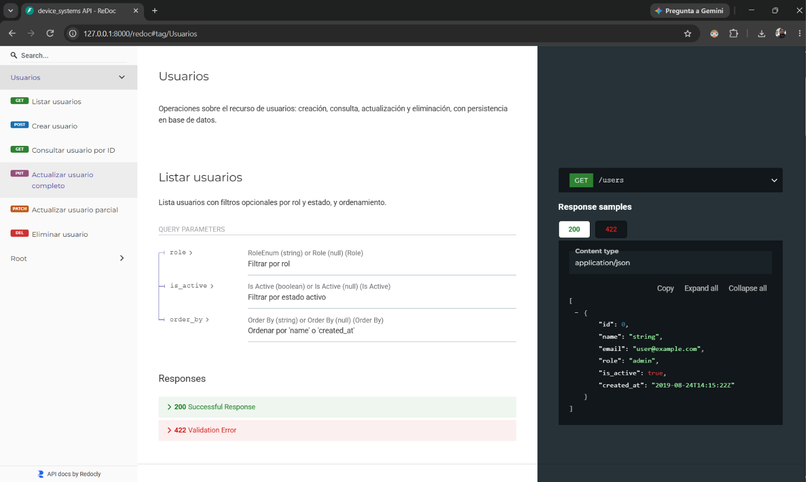
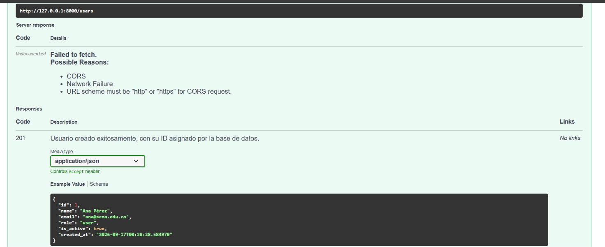
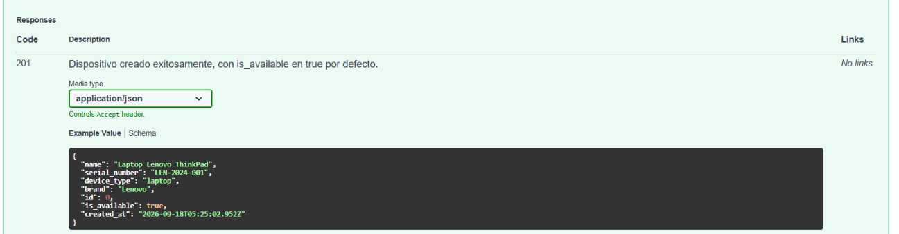
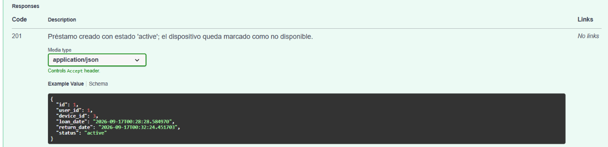
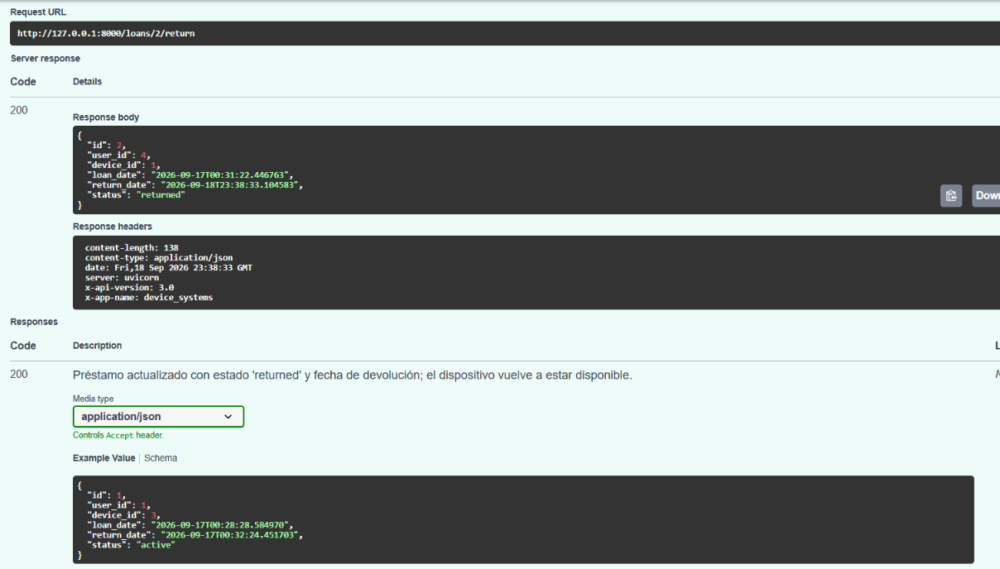
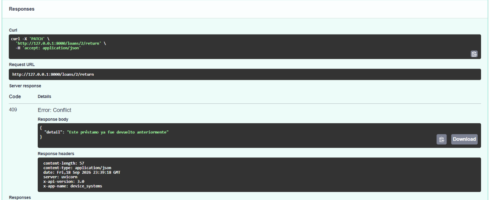

# device_systems

API REST desarrollada con **FastAPI** para la gestión de usuarios, dispositivos y préstamos del sistema `device_systems`. Este proyecto evoluciona desde un CRUD básico de usuarios hacia un sistema relacional completo, incorporando **SQLAlchemy** para persistencia, **Alembic** para migraciones versionadas de base de datos, asociaciones entre modelos (`ForeignKey`, `relationship`) y consultas avanzadas con **joins** y filtros combinados.

## Descripción de la API

`device_systems` expone tres recursos principales:

- **`/users`** — gestión de usuarios del sistema (crear, listar, consultar, actualizar, eliminar, filtrar por rol y estado).
- **`/devices`** — gestión de dispositivos tecnológicos disponibles para préstamo (crear, listar, consultar, actualizar, eliminar, filtrar por tipo, marca, disponibilidad y búsqueda de texto).
- **`/loans`** — gestión de préstamos, asociando un usuario con un dispositivo: creación con validación de disponibilidad, devolución, y consultas con joins que muestran información relacionada de usuario y dispositivo en una sola respuesta.

Características generales:

- Persistencia con **SQLAlchemy** sobre SQLite.
- Migraciones de base de datos versionadas con **Alembic**.
- Relaciones **One-to-Many / Many-to-One** entre `User`, `Device` y `Loan`, usando `ForeignKey()` y `relationship()` con `back_populates`.
- Consultas con `join()`, `and_()`, `ilike()` y filtros opcionales combinados.
- Validación de datos mediante modelos Pydantic, con ejemplos incluidos en la documentación automática.
- Manejo de errores claro y consistente usando `HTTPException` (404, 400, 409, 422).
- Documentación interactiva vía Swagger UI y ReDoc, organizada por tags (`Usuarios`, `Dispositivos`, `Préstamos`).
- Reutilización de lógica común mediante Dependency Injection (`Depends()`).

## Tecnologías utilizadas

| Tecnología | Uso |
|---|---|
| Python 3.14 | Lenguaje base |
| FastAPI | Framework principal de la API |
| SQLAlchemy | ORM y acceso a base de datos |
| Alembic | Migraciones versionadas de base de datos |
| Pydantic v2 | Validación y serialización de datos |
| SQLite | Motor de base de datos (desarrollo) |
| Uvicorn | Servidor ASGI |
| uv | Gestor de dependencias y entornos virtuales |
| Swagger UI / ReDoc | Documentación automática |

## Estructura del proyecto

El proyecto sigue una separación de responsabilidades por capas, ampliada para soportar los tres recursos (`users`, `devices`, `loans`) y las migraciones de Alembic:

```
device_systems/
├── app/
│   ├── main.py                          # Punto de entrada, configuración de FastAPI y middleware
│   ├── database/
│   │   └── connection.py                # Engine, SessionLocal y Base declarativa
│   ├── models/
│   │   ├── user_model.py                # Modelo SQLAlchemy de User
│   │   ├── device_model.py              # Modelo SQLAlchemy de Device
│   │   └── loan_model.py                # Modelo SQLAlchemy de Loan (con ForeignKey a User y Device)
│   ├── schemas/
│   │   ├── user_schema.py               # Modelos Pydantic de User
│   │   ├── device_schema.py             # Modelos Pydantic de Device
│   │   └── loan_schema.py               # Modelos Pydantic de Loan (incluye LoanDetailResponse)
│   ├── services/
│   │   ├── user_service.py              # Lógica de negocio de usuarios
│   │   ├── device_service.py            # Lógica de negocio de dispositivos
│   │   └── loan_service.py              # Lógica de negocio de préstamos, incluyendo joins
│   ├── routes/
│   │   ├── user_routes.py               # Endpoints del recurso /users
│   │   ├── device_routes.py             # Endpoints del recurso /devices
│   │   └── loan_routes.py               # Endpoints del recurso /loans
│   └── dependencies/
│       ├── database_dependency.py       # Dependencia get_db()
│       ├── user_dependencies.py         # Dependencias reutilizables de User
│       ├── device_dependencies.py       # Dependencias reutilizables de Device
│       └── loan_dependencies.py         # Dependencias reutilizables de Loan
├── alembic/
│   ├── versions/                        # Migraciones generadas
│   └── env.py                           # Configuración de Alembic (Base.metadata, URL de conexión)
├── alembic.ini
├── Imagenes/
│   ├── ...                              # Evidencias de la actividad anterior (CRUD básico de usuarios)
│   └── AlembicRelaciones/               # Evidencias de esta actividad (Alembic, relaciones, joins)
├── pyproject.toml
├── uv.lock
└── README.md
```

**Explicación de las capas:**

- **database**: configura el `engine`, la fábrica de sesiones (`SessionLocal`) y la clase base declarativa (`Base`) de la que heredan todos los modelos.
- **models**: define la estructura real de las tablas en la base de datos, incluyendo las relaciones (`relationship()`, `ForeignKey()`) entre `User`, `Device` y `Loan`.
- **schemas**: define la forma de los datos que entran y salen por la API (validación con Pydantic), independiente de la estructura de la base de datos.
- **services**: contiene la lógica de negocio, desacoplada de FastAPI, incluyendo las consultas con `join()` y filtros combinados.
- **routes**: define los endpoints (URLs, métodos HTTP, códigos de estado, tags, `response_description`) y delega la lógica a `services`.
- **dependencies**: funciones reutilizables inyectadas con `Depends()`, que evitan repetir código de validación en múltiples endpoints.
- **alembic**: contiene el historial versionado de cambios estructurales de la base de datos, permitiendo aplicar o revertir migraciones de forma controlada.

## Instalación y ejecución

### 1. Clonar el repositorio

```bash
git clone https://github.com/Sehuto96/Device_Systems.git
cd device_systems
```

### 2. Instalar dependencias con uv

```bash
uv sync
```

### 3. Aplicar las migraciones de base de datos

```bash
uv run alembic upgrade head
```

### 4. Ejecutar el servidor de desarrollo

```bash
uv run fastapi dev app/main.py
```

El servidor quedará disponible en:

- API: `http://127.0.0.1:8000`
- Swagger UI: `http://127.0.0.1:8000/docs`
- ReDoc: `http://127.0.0.1:8000/redoc`

## Migraciones con Alembic

El proyecto usa Alembic para versionar los cambios estructurales de la base de datos, en vez de depender únicamente de `Base.metadata.create_all()`.

### Comandos principales

**Generar una nueva migración** (detecta automáticamente los cambios entre los modelos SQLAlchemy y el estado actual de la base de datos):

```bash
uv run alembic revision --autogenerate -m "descripción del cambio"
```

**Aplicar las migraciones pendientes:**

```bash
uv run alembic upgrade head
```

**Consultar el historial de migraciones:**

```bash
uv run alembic history
```

### Configuración

Alembic fue configurado en `alembic/env.py` para:

- Reconocer la URL de conexión desde `app/database/connection.py` (`DATABASE_URL`), evitando duplicarla en `alembic.ini`.
- Usar la metadata de SQLAlchemy (`Base.metadata`) para detectar automáticamente los modelos.
- Importar explícitamente todos los modelos (`User`, `Device`, `Loan`) para que Alembic los registre antes de comparar el estado de la base de datos.

### Migración inicial de esta fase

La migración `create devices and loans tables` creó las tablas `devices` y `loans`, incluyendo las `ForeignKeyConstraint` de `loans` hacia `users.id` y `devices.id`, sin afectar la tabla `users` ya existente.

**Evidencia — Historial de migraciones:**


## Asociaciones entre modelos

Se implementaron relaciones **One-to-Many / Many-to-One** entre los tres modelos, usando `ForeignKey()` a nivel de base de datos y `relationship()` con `back_populates` a nivel de ORM:

- **User → Loan**: un usuario puede tener muchos préstamos (`user.loans`).
- **Device → Loan**: un dispositivo puede aparecer en muchos préstamos históricos (`device.loans`).
- **Loan → User / Device**: cada préstamo pertenece a un único usuario y a un único dispositivo (`loan.user`, `loan.device`).

```python
# En Loan
user_id = Column(Integer, ForeignKey("users.id"), nullable=False)
device_id = Column(Integer, ForeignKey("devices.id"), nullable=False)

user = relationship("User", back_populates="loans")
device = relationship("Device", back_populates="loans")
```

El `ForeignKey` garantiza la **integridad referencial** a nivel de base de datos (no se puede crear un préstamo con un `user_id` o `device_id` inexistente), mientras que `relationship()` permite navegar entre objetos relacionados en Python (por ejemplo, `mi_prestamo.user.name`) sin escribir el JOIN manualmente.

**Evidencia — Estructura de tablas generadas:**


## Tabla de endpoints

### Usuarios

| Método | Ruta | Descripción | Código de éxito |
|---|---|---|---|
| GET | `/users` | Lista usuarios, con filtros opcionales por `role` e `is_active` | 200 OK |
| GET | `/users/{user_id}` | Consulta un usuario específico por ID | 200 OK |
| GET | `/users/{user_id}/loans` | Consulta los préstamos asociados a un usuario | 200 OK |
| POST | `/users` | Crea un nuevo usuario | 201 Created |
| PUT | `/users/{user_id}` | Reemplaza completamente los datos de un usuario | 200 OK |
| PATCH | `/users/{user_id}` | Actualiza parcialmente un usuario | 200 OK |
| DELETE | `/users/{user_id}` | Elimina un usuario existente | 204 No Content |

### Dispositivos

| Método | Ruta | Descripción | Código de éxito |
|---|---|---|---|
| GET | `/devices` | Lista dispositivos, con filtros por `device_type`, `is_available`, `brand` y `search` | 200 OK |
| GET | `/devices/{device_id}` | Consulta un dispositivo específico por ID | 200 OK |
| GET | `/devices/{device_id}/loans` | Consulta el historial de préstamos de un dispositivo | 200 OK |
| POST | `/devices` | Crea un nuevo dispositivo | 201 Created |
| PUT | `/devices/{device_id}` | Reemplaza completamente los datos de un dispositivo | 200 OK |
| PATCH | `/devices/{device_id}` | Actualiza parcialmente un dispositivo | 200 OK |
| DELETE | `/devices/{device_id}` | Elimina un dispositivo existente | 204 No Content |

### Préstamos

| Método | Ruta | Descripción | Código de éxito |
|---|---|---|---|
| GET | `/loans` | Lista préstamos, con filtros por `status`, `user_id` y `device_id` | 200 OK |
| GET | `/loans/details` | Lista préstamos con datos embebidos de usuario y dispositivo (join), con filtros por `status`, `user_email` y `device_type` | 200 OK |
| GET | `/loans/{loan_id}` | Consulta un préstamo específico por ID | 200 OK |
| POST | `/loans` | Crea un préstamo, validando usuario, dispositivo y disponibilidad | 201 Created |
| PATCH | `/loans/{loan_id}/return` | Registra la devolución de un préstamo | 200 OK |

## Códigos de estado HTTP utilizados

| Código | Significado | Cuándo se retorna |
|---|---|---|
| 200 OK | Operación exitosa | GET, PUT, PATCH y devoluciones exitosas |
| 201 Created | Recurso creado exitosamente | POST exitoso |
| 204 No Content | Eliminación exitosa, sin cuerpo de respuesta | DELETE exitoso |
| 400 Bad Request | Solicitud inválida | Correo o número de serie duplicado, PATCH sin campos enviados |
| 404 Not Found | Recurso no encontrado | Usuario, dispositivo o préstamo inexistente |
| 409 Conflict | Regla de negocio incumplida | Dispositivo no disponible para préstamo, préstamo ya devuelto |
| 422 Unprocessable Entity | Error de validación de datos | Datos con formato/tipo inválido (rol, estado o filtro fuera del enum permitido) |

## Ejemplos de peticiones y respuestas

### Crear dispositivo — `POST /devices`

**Request:**
```json
{
  "name": "Laptop Lenovo ThinkPad",
  "serial_number": "LEN-2024-001",
  "device_type": "laptop",
  "brand": "Lenovo"
}
```

**Response — 201 Created:**
```json
{
  "id": 1,
  "name": "Laptop Lenovo ThinkPad",
  "serial_number": "LEN-2024-001",
  "device_type": "laptop",
  "brand": "Lenovo",
  "is_available": true,
  "created_at": "2026-09-17T00:00:00"
}
```

### Crear préstamo — `POST /loans`

**Request:**
```json
{
  "user_id": 4,
  "device_id": 1
}
```

**Response — 201 Created:**
```json
{
  "id": 2,
  "user_id": 4,
  "device_id": 1,
  "loan_date": "2026-09-17T00:31:22.446763",
  "return_date": null,
  "status": "active"
}
```

### Dispositivo no disponible — `POST /loans`

**Response — 409 Conflict:**
```json
{
  "detail": "El dispositivo no está disponible para préstamo"
}
```

### Devolución de préstamo — `PATCH /loans/{loan_id}/return`

**Response — 200 OK:**
```json
{
  "id": 2,
  "user_id": 4,
  "device_id": 1,
  "loan_date": "2026-09-17T00:31:22.446763",
  "return_date": "2026-09-17T00:35:10.123456",
  "status": "returned"
}
```

### Préstamo ya devuelto — `PATCH /loans/{loan_id}/return`

**Response — 409 Conflict:**
```json
{
  "detail": "Este préstamo ya fue devuelto anteriormente"
}
```

### Consulta con join — `GET /loans/details`

**Response — 200 OK:**
```json
[
  {
    "loan_id": 1,
    "status": "returned",
    "loan_date": "2026-09-17T00:28:28.584970",
    "return_date": "2026-09-17T00:32:24.451703",
    "user": {
      "id": 4,
      "name": "Edwin Ospina",
      "email": "edwino@example.com"
    },
    "device": {
      "id": 1,
      "name": "Laptop Lenovo ThinkPad",
      "serial_number": "LEN-2024-001",
      "device_type": "laptop"
    }
  }
]
```

## Uso de Dependency Injection (`Depends()`)

El proyecto reutiliza lógica común mediante dependencias definidas en `app/dependencies/`:

- **`get_user_or_404` / `get_device_or_404` / `get_loan_or_404`**: buscan un recurso por su ID y lanzan `404` automáticamente si no existe, antes de que la función del endpoint se ejecute.
- **`validate_email_unique_for_create/update`**: valida que el correo no esté duplicado al crear o actualizar un usuario.
- **`validate_serial_unique_for_create/update`**: valida que el número de serie no esté duplicado al crear o actualizar un dispositivo.
- **`validate_loan_creation`**: valida, antes de crear un préstamo, que el usuario exista, el dispositivo exista y esté disponible.
- **`validate_loan_not_returned`**: valida, antes de procesar una devolución, que el préstamo no haya sido devuelto previamente. Depende a su vez de `get_loan_or_404`, formando una cadena de dependencias.

Este enfoque evita repetir la misma validación en múltiples endpoints, centraliza la lógica y hace el código más mantenible y fácil de probar.

## Manejo de errores

La API controla los siguientes escenarios usando `HTTPException`:

- **Usuario, dispositivo o préstamo no encontrado** → `404 Not Found`.
- **Correo o número de serie duplicado** → `400 Bad Request`.
- **Dispositivo no disponible para préstamo** → `409 Conflict`.
- **Préstamo ya devuelto** → `409 Conflict`.
- **Rol, estado o filtro fuera del enum permitido** → `422 Unprocessable Entity`, validado automáticamente por Pydantic (`RoleEnum`, `LoanStatus`).
- **Actualización parcial sin datos** → `400 Bad Request`, cuando el body de un `PATCH` llega vacío.

Todas las respuestas de error siguen el formato estándar de FastAPI:

```json
{
  "detail": "Mensaje descriptivo del error"
}
```

## Documentación automática

FastAPI genera documentación interactiva automáticamente a partir de los modelos Pydantic (con ejemplos incluidos vía `examples=[...]`) y los metadatos configurados en `main.py`, organizada en tres tags: **Usuarios**, **Dispositivos** y **Préstamos**.

- **Swagger UI**: `http://127.0.0.1:8000/docs`
- **ReDoc**: `http://127.0.0.1:8000/redoc`

### Captura — Swagger UI


### Captura — ReDoc



## Evidencia de pruebas funcionales

### Migraciones con Alembic


### Crear usuario — `POST /users`



### Crear dispositivo — `POST /devices`



### Crear préstamo — `POST /loans`



### Intentar prestar un dispositivo no disponible — `POST /loans`


### Listar préstamos con información relacionada — `GET /loans/details`


### Filtrar préstamos por estado — `GET /loans/details?status=active`


### Filtrar préstamos por tipo de dispositivo — `GET /loans/details?device_type=laptop`


### Consultar préstamos de un usuario — `GET /users/{user_id}/loans`


### Devolución de préstamo — `PATCH /loans/{loan_id}/return`



### Intentar devolver un préstamo ya devuelto — `PATCH /loans/{loan_id}/return`



## Reflexión final
Esta actividad me ayudó a entender que una API no es solo crear endpoints, sino pensar bien cómo se relacionan los datos entre sí. Al principio me costó entender la diferencia entre ForeignKey() y relationship(): el primero es lo que realmente conecta las tablas en la base de datos, y el segundo es lo que me permite acceder a esos datos relacionados desde Python de forma más fácil, sin escribir el JOIN a mano cada vez.

Trabajar con Alembic también fue nuevo para mí. Antes simplemente dejaba que SQLAlchemy creara las tablas automáticamente, pero ahora entiendo que eso no queda documentado en ningún lado. Con Alembic cada cambio en la base de datos queda guardado en un archivo, y puedo ver el historial con alembic history o revisar exactamente qué se va a modificar antes de aplicar los cambios con upgrade head. Me pareció importante aprender que siempre hay que revisar la migración generada antes de aplicarla, y no hacerlo a ciegas.

La parte de los joins fue la que más trabajo me costó entender al principio, pero también la que más me gustó. Ver cómo con una sola consulta podía traer el préstamo junto con los datos del usuario y del dispositivo, en vez de hacer varias consultas separadas, me hizo ver la utilidad real de usar bien un ORM.

Tuve algunos errores en el camino, casi todos por descuido: imports duplicados, una función repetida sin darme cuenta, y una vez se me olvidó poner un return en un endpoint, lo cual me generó un error que no entendía hasta que revisé el traceback completo en la terminal. Eso me enseñó a leer con más calma el código antes de guardarlo, y a no quedarme solo con el mensaje de error de Swagger, sino ir a ver el detalle en la consola.

Si siguiera mejorando esta API, me gustaría agregarle autenticación para que no cualquiera pueda usar los endpoints, y aprender a hacer pruebas automáticas en vez de probar todo manualmente en Swagger cada vez.

## Autor

Sebastian Hurtado — [GitHub](https://github.com/Sehuto96/Device_Systems)
